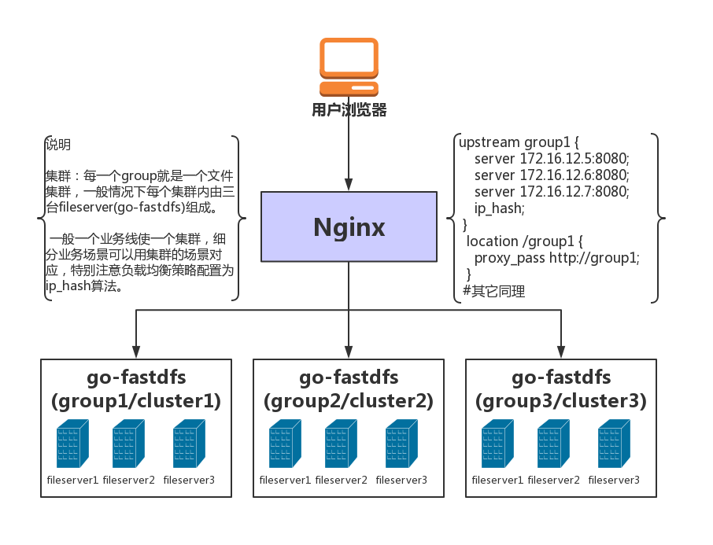

# [中文](README.md)  [English](README-en.md)


# go-fastdfs是一个基于http的分布式文件系统，它基于大道至简的设计理念，一切从简设计，使得它的运维及扩展变得更加简单，它具有高性能、高可靠、无中心、免维护等优点。


- 支持curl命令上传
- 支持浏览器上传
- 支持HTTP下载
- 支持多机自动同步
- 支持断点下载
- 支持配置自动生成
- 支持自监控告警
- 支持集群文件信息查看
- 使用通用HTTP协议
- 无需专用客户端（支持wget,curl等工具）
- 类fastdfs
- 高性能 （使用leveldb作为kv库）
- 高可靠（设计极其简单，使用成熟组件）
- 无中心设计(所有节点都可以同时读写)

# 优点

- 无依赖(单一文件）
- 自动同步
- 失败自动修复
- 按天分目录方便维护
- 支持不同的场景
- 文件自动去重
- 支持目录自定义
- 支持保留原文件名
- 支持自动生成唯一文件名
- 支持浏览器上传
- 支持查看集群文件信息
- 支持集群监控邮件告警
- 支持token下载　token=md5(file_md5+timestamp)
- 运维简单，只有一个角色（不像fastdfs有三个角色Tracker Server,Storage Server,Client），配置自动生成
- 每个节点对等（简化运维）
- 所有节点都可以同时读写


# 启动服务器（已编译，[下载](https://github.com/sjqzhang/fastdfs/releases)极速体验，只需一分钟）

`./fileserver`


# 命令上传

`curl -F file=@http-index-fs http://10.1.xx.60:8080/upload` 	


# WEB上传（浏览器打开）

`http://yourserver ip:8080` 注意：不要使用127.0.0.1上传 	

# 代码上传(选项参阅浏览器上传)

python版本:
```python
import requests
url = 'http://10.1.5.9:8080/upload'
files = {'file': open('report.xls', 'rb')}
options={'output':'json','path':'','scene':''} #参阅浏览器上传的选项
r = requests.post(url, files=files)
print(r.text)
```
golang版本
```go
package main

import (
	"fmt"
	"github.com/astaxie/beego/httplib"
)

func main()  {
	var obj interface{}
	req:=httplib.Post("http://10.1.5.9:8080/upload")
	req.PostFile("file","path/to/file")
	req.Param("output","json")
	req.Param("scene","")
	req.Param("path","")
	req.ToJSON(&obj)
	fmt.Print(obj)
}
```
[更多请参考](doc/upload.md)

部署图



# 有问题请[点击反馈](https://github.com/sjqzhang/go-fastdfs/issues/new)

# 重要说明
## 在issue中有很多实际使用的问题及回答（很多已关闭，请查看已关闭的issue）


# Q&A
- 在微信讨论群中大家都问到go-fastdfs性能怎样？
```
由于问的人太多，在这里统一回答。
go-fastdfs的文件定位与其它分布式系统不同，它的寻址是直接定位，不经过任何组件，所以可以近似时间复杂度为o(1)[文件路径定位]
基本没有性能损耗，项目中也附有压测脚本，大家可以自已进行压测，群里就不要太多讨论问题了，人多每次回复同样的问题
大家也会觉得这群无聊。
```


- 已经使用fastdfs存储的文件可以迁移到go fastdfs下么？
```
答案是可以的，你担心的问题是路径改变,go fastdfs为你考虑了这一点

curl -F file=@data/00/00/_78HAFwyvN2AK6ChAAHg8gw80FQ213.jpg -F path=M00/00/00/ http://127.0.0.1:8080/upload

同理可以用一行命令迁移所有文件

cd fastdfs/data && find -type f |xargs -n 1 -I {} curl -F file=@data/{} -F path=M00/00/00/ http://127.0.0.1:8080/

以上命令可以过迁粗糙
可以写一些简单脚本进行迁移

```

- 什么是集群，如何用Nginx管理多集群？
```
1、在go-fastdfs中，一个集群就是一个group。
2、请参阅部署图
注意：配置中的 support_group_manage 参数设为true时，所有的url中都自动添加组信息。
例如：http://10.1.5.9:8080/group/status
默认：http://10.1.5.9:8080/status
区别：多了group,对应配置中的 group 参数,这样主要是为了解决一个Nginx反向代理多个group(集群)
具体请参阅部署图

```


- 如何搭建集群？
```
一、先下载已编译的可执行文件（用最新版本）
二、运行可执行文件（生成配置）
三、修改配置
	peers：增加对端的http地址
	检查:
	host:自动生成是否正确
	peer_id:集群内是否唯一
四、重新运行服器
五、验证服务是否OK
```


- 适合海量存储吗？
```
答案：适合海量存储
特别说明：
需然用leveldb作为元数据存储，但不强依懒leveldb，
并且进行超过1亿以上的文件进行压测(可以用项目提供的脚本进行压测，有问题及时反馈到issue)，
1亿文件元数据大小约5G,导出元数据文本大小22G

```

- 还需要安装nginx么？
```
可以不安装，也可以选择安装
go fastdfs 本身就是一个高性能的web文件服务器。
```

- 能动态加载配置么？
```
答案：是可以的，但要更新到最新版本
步骤：
1）修改 conf/cfg.json 文件
2）访问 http://10.1.xx.60:8080/reload
3） 注意：每个节点都需要进行同样的操作
```


- 内存占用很高是怎么回事？
```
正常情况下，内存应该低于2G，除非每天上传文件超过百万
内存异常，主要是集群的文件没有同步，同时开启了自动修复功能
处理办法，删除data目录下当天的errors.md5文件，关闭自动修复，重启服务
参阅系统状态说明

```

- 如何查看集群文件信息？
```
http://10.1.xx.60:8080/stat

如果出现文件统计出错怎么办？
请删除 data目录下的 stat.json文件 重启服务，请系统自动重新计算文件数。

或者调用
http://10.1.xx.60:8080/repair_stat

```
- 可靠性怎样，能用于生产环境么？
```
本项目已大规模用于生产环境，如担心不能满足
可以在使用前对其各项特性进行压力测试，有任何
问题可以直接提issue
```

- 能不能在一台机器部置多个服务端？
```
不能，在设计之初就已考虑到集群的高可用问题，为了保证集群的真正可用，必须为不同的ip,ip 不能用 127.0.0.1
错误　"peers": ["http://127.0.0.1:8080","http://127.0.0.1:8081","http://127.0.0.1:8082"]
正确　"peers": ["http://10.0.0.3:8080","http://10.0.0.4:8080","http://10.0.0.5:8080"]
```
- 文件不同步了怎么办？
```
正常情况下，集群会每小时自动同步修复文件。（性能较差，在海量情况下建议关闭自动修复）
那异常情况下怎么？
答案：手动同步（最好在低峰执行）
http://172.16.70.123:7080/sync?date=20190117&force=1 (说明：要在文件多的服务器上执行，相关于推送到别的服务器)
参数说明：date 表示同步那一天的数据　force　1.表示是否强制同步当天所有(性能差)，0.表示只同步失败的文件

不同步的情况：
1) 原来运行N台，现在突然加入一台变成N+1台
2）原来运行N台，某一台机器出现问题，变成N-1台

如果出现多天数据不一致怎么办？能一次同步所有吗？
答案是可以：(最好在低峰执行)
http://172.16.70.123:7080/repair?force=1

```

- 文件不同步会影响访问吗？
```
答案：不会影响，会在访问不到时，自动修复不同步的文件。
```

- 如何查看系统状态及说明？
```
http://172.16.70.123:7080/status
注意:（Fs.Peers是不带本机的，如果带有可能出问题）
本机为 Fs.Local
sts["Fs.ErrorSetSize"] = this.errorset.Cardinality()  这个会导致内存增加

```

- 如何压测？
```
先用gen_file.py产生大量文件（注意如果要生成大文件，自已在内容中乘上一个大的数即可）
例如:
# -*- coding: utf-8 -*-
import os
j=0
for i in range(0,1000000):
    if i%1000==0:
        j=i
        os.system('mkdir %s'%(i))
    with open('%s/%s.txt'%(j,i),'w+') as f:
        f.write(str(i)*1024)
接着用benchmark.py进行压测
也可以多机同时进行压测，所有节点都是可以同时读写的
```

- 支持断点下载？
```
答案：支持
curl wget 如何
wget -c http://10.1.5.9:8080/group1/default/20190128/16/10/2G
culr -C - http://10.1.5.9:8080/group1/default/20190128/16/10/2G
```

- 集群如何规划及如何进行扩容？
```
建议在前期规划时，尽量采购大容量的机器作为存储服务器，如果要两个复本就用两台组成一个集群，如果要三个复本
就三台组成一个集群。（注意每台服务器最好配置保持一样）

如果提高可用性，只要在现在的集群peers中加入新的机器，再对集群进行修复即可。
修复办法 http://172.16.70.123:7080/repair?force=1  （建议低峰变更）

如何扩容？
为简单可靠起见，直接搭建一个新集群即可（搭建就是启动./fileserver进程，设置一下peers的IP地址，三五分钟的事）
issue中chengyuansen同学向我提议使用增加扩容特性，我觉得对代码逻辑及运维都增加复杂度，暂时没有加入这特性。

```

- 访问限制问题
```
出于安全考虑,管理API只能在群集内部调用或者用127.0.0.1调用.
```


- 有问题请[点击反馈](https://github.com/sjqzhang/go-fastdfs/issues/new)
或加


